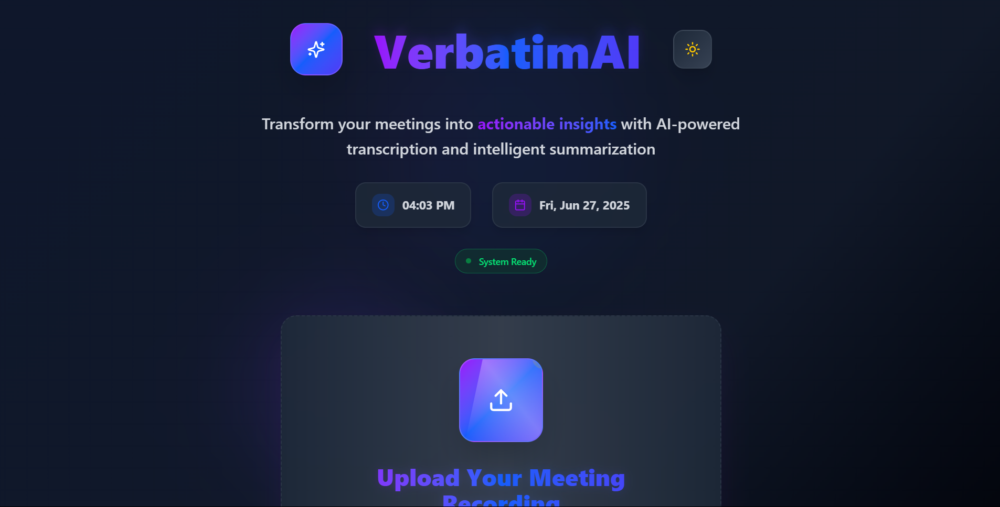
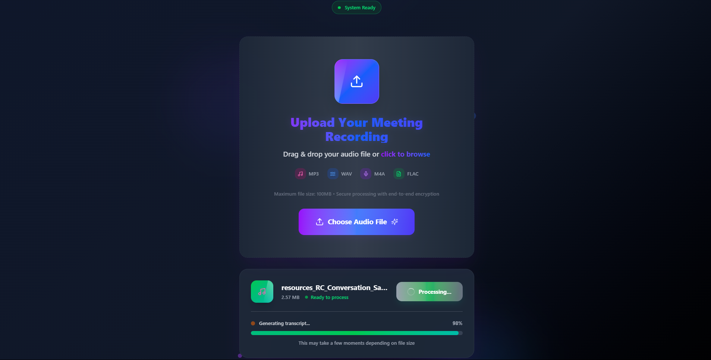
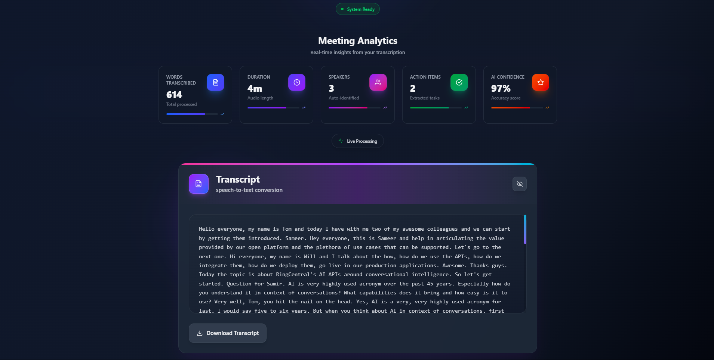
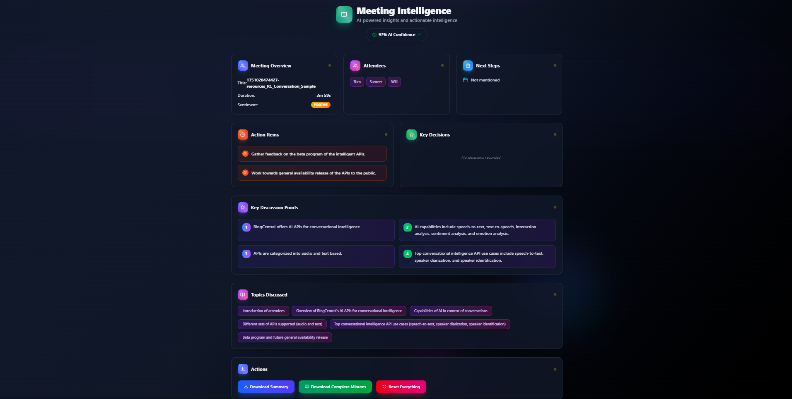

# ✨ VerbtimAI – Smart Meeting Minute Generator

> 🚀 Turn speech into **actionable meeting minutes** in seconds. VerbtimAI automatically transcribes audio, extracts key points, and delivers summaries, tasks, and next steps – all with the power of AI.

🌐 **Live App:** [https://verbatimai-ten.vercel.app](https://verbatimai-ten.vercel.app)

---

## 🧠 Features

✅ **AI-Powered Transcription**  
✅ **Meeting Summaries & Action Points**  
✅ **Next Steps Extraction**  
✅ **Confidence & Sentiment Analysis**  
✅ **Supports Audio Uploads**  
✅ **Clean, Modern UI (Built with React & Tailwind CSS)**  
✅ **Fully Responsive & Mobile Friendly**

---

## 📸 Screenshots

  
   
  
   
  

